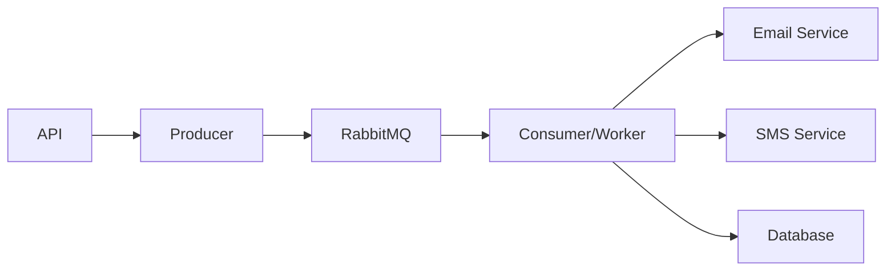

# Queue System Documentation

## Overview

The notification service uses RabbitMQ for asynchronous message processing. This allows for reliable message delivery and scalable notification processing.

## Architecture



## Components

### 1. Base RabbitMQ (`base.py`)
- Provides base connection handling
- Manages queue declarations
- Handles connection lifecycle

```python
QUEUE_NAMES = {
    'email': 'email_notifications',
    'sms': 'sms_notifications'
}
```

### 2. Producer (`producer.py`)
- Sends notifications to appropriate queues
- Handles message serialization
- Ensures message persistence

Example usage:
```python
producer = NotificationProducer()
try:
    producer.send_notification('email', notification_data)
finally:
    producer.close()
```

### 3. Consumer (`consumer.py`)
- Processes messages from queues
- Updates notification status in database
- Handles message acknowledgment and error recovery

Message Processing Flow:
1. Receive message
2. Update status to "processing"
3. Process notification
4. Update status to "sent"
5. Acknowledge message

### 4. Worker System (`worker.py`)
- Manages multiple consumer processes
- Handles different notification types
- Provides process isolation

## Message Flow

1. **API Request**:
```json
POST /api/v1/notifications/send
{
    "type": "email",
    "recipient": "user@example.com",
    "content": "Hello!",
    "variables": {}
}
```

2. **Database Entry**:
- Create notification record
- Initial status: "pending"

3. **Queue Message**:
```json
{
    "id": "uuid",
    "type": "email",
    "recipient": "user@example.com",
    "content": "Hello!",
    "variables": {},
    "status": "pending"
}
```

4. **Processing States**:
- pending → processing → sent/failed

## Running Workers

### Docker Environment
Workers are automatically started by the worker service in docker-compose:
```yaml
worker:
  build:
    context: .
    args:
      - RUN_MODE=worker
```

### Local Development
Run workers manually:
```bash
python worker_runner.py
```

## Error Handling

1. **Producer Errors**:
- Failed messages update notification status to "failed"
- Exceptions are logged and raised to API

2. **Consumer Errors**:
- Failed messages are returned to queue (requeued)
- Status updated to "failed" with error details
- Multiple retry attempts before permanent failure

## Monitoring

1. **Queue Status**:
- RabbitMQ Management UI: http://localhost:15672
- Credentials: user/passwordmq

2. **Notification Status**:
- API Endpoint: GET /api/v1/notifications/{id}/status
- Database queries for status history

## Best Practices

1. **Message Persistence**:
- All messages are marked as persistent
- RabbitMQ configured for disk storage

2. **Connection Management**:
- Always use try/finally for connections
- Close connections after use
- Handle connection failures gracefully

3. **Scaling**:
- Multiple worker processes per queue
- prefetch_count=1 for load balancing
- Separate processes for different notification types